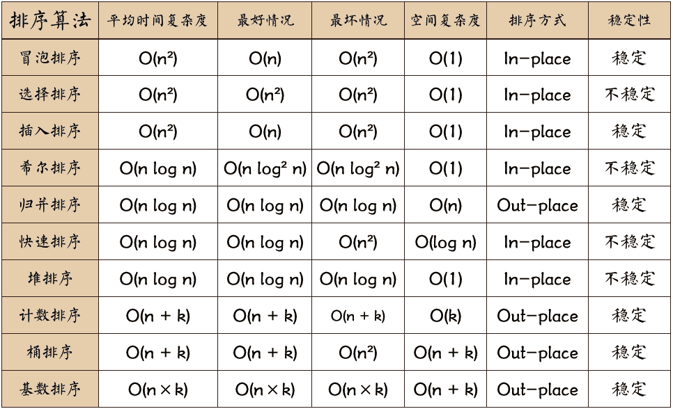
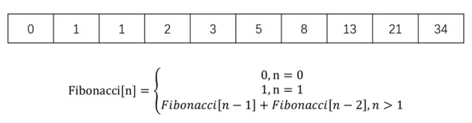

# 数据结构与算法

## 学习资料

- [代码随想录](https://programmercarl.com/)

## 数组

- 数组是存放在连续内存空间上的相同类型数据的集合

### 例题

- [704. 二分查找](https://leetcode-cn.com/problems/binary-search/)

## 排序

[动画演示](https://visualgo.net/en/sorting)



### 插入排序

#### 思路

- 从第二个数开始往前比
- 比它大就往后排
- 以此类推进行到最后一个数

#### 实现

```javascript
Array.prototype.insertionSort = function () {
    for (let i = 1; i < this.length; i++) {
        const temp = this[i]
        let j = i
        while (j > 0) {
            if (this[j - 1] > temp) {
                this[j] = this[j - 1]
            } else {
                break
            }
            --j
        }
        this[j] = temp
    }
}
```

### 归并排序

#### 思路

- 分：把数组劈成两半，再递归地对子数组进行"分"操作，直到分成一个个单独的数。
- 合：把两个数合并为有序数组，再对有序数组进行合并，直到全部子数组合并为一个完整数组。

#### 实现

```javascript
Array.prototype.mergeSort = function () {
    const rec = (arr) => {
        // 分
        if (arr.length === 1) { return arr }
        const mid = Math.floor(arr.length / 2 )
        const left = arr.slice(0, mid)
        const right = arr.slice(mid, arr.length)
        const orderedLeft = rec(left)
        const orderedRight = rec(right)

        // 合
        const res = []
        while (orderedLeft.length || orderedRight.length) {
            if (orderedLeft.length && orderedRight.length) {
                res.push(orderedLeft[0] < orderedRight[0] ? orderedLeft.shift() : orderedRight.shift())
            } else if (orderedLeft.length) {
                res.push(orderedLeft.shift())
            } else if (orderedRight.length) {
                res.push(orderedRight.shift())
            }
        }
        return res
    }
    const orderedArr = rec(this)
    orderedArr.forEach((n, i) => { this[i] = n })
}
```

### 快速排序

#### 思路

- 分区：从数组中任意选择一个"基准"，所有比基准小的元素放在基准前面，比基准大的元素放在基准的后面。
- 递归：递归地对基准前后的子数组进行分区。


#### 实现

```javascript
Array.prototype.quickSort = function () {
    const rec = (arr) => {
        if (arr.length <= 1) { return arr }
        const mid = arr[0]
        const left = []
        const right = []
        for (let i = 1; i < arr.length; i++) {
            const n = arr[i]
            if (n < mid) {
                left.push(n)
            } else {
                right.push(n)
            }
        }
        return [...rec(left), mid, ...rec(right)]
    }
    const res = rec(this)
    res.forEach((v, i) => { this[i] = v })
}
```

#### 时间复杂度

- 递归的时间复杂度：O(logN)
- 分区操作的时间复杂度：O(n)
- 总时间复杂度：O(n*logN)

## 搜索

### 顺序搜索

#### 思路

- 遍历数组
- 找到跟目标值相等的元素，就返回它的下标
- 遍历结束后，如果没有搜索到目标值，就返回-1

#### 实现

```javascript
Array.prototype.sequentialSearch = function (item) {
    for (let i = 0; i < this.length; i++) {
        if (this[i] === item) {
            return i
        }
    }
    return -1
}
```

#### 时间复杂度

- 遍历数组是一个循环操作
- 时间复杂度：O(n)

### 二分搜索

#### 思路

前提：数组有序

- 从数组的中间元素开始，如果中间元素正好是目标值，则搜索结束
- 如果目标值大于或者小于中间元素，则在大于或小于中间元素的那一半数组中搜索

#### 实现

javascript:

```javascript
Array.prototype.binarySearch = function (item) {
    let low = 0
    let high = this.length - 1
    while (low <= high) {
        const mid = Math.floor((low + high) / 2)
        const element = this[mid]
        if (element < item) {
            low = mid + 1
        } else if (element > item) {
            high = mid - 1
        } else {
            return mid
        }
    }
    return -1
}
```

typescript:

```typescript
function search(nums: number[], target: number): number {
    let left = 0
    let right = nums.length - 1
    while (left <= right) {
        const mid = Math.floor((left + right) / 2)
        const data = nums[mid]
        if (data === target) {
            return mid
        } else if (data > target) {
            right = mid - 1
        } else {
            left = mid + 1
        }
    }
    return -1
}
```

#### 时间复杂度

- 每一次比较都使搜索范围缩小一半
- 时间复杂度：O(logN)

### 例题

- [21. 合并两个有序链表](https://leetcode-cn.com/problems/merge-two-sorted-lists/)
- [374. 猜数字大小](https://leetcode-cn.com/problems/guess-number-higher-or-lower/)

## 分而治之

- 分而治之是 *算法设计* 中的一种方法
- 它将一个问题 **分** 成多个和原问题相似的小问题，**递归解决** 小问题，再将结果 **合** 并以解决原来的问题

### 场景一：[归并排序](#归并排序)

- 分：把数组从中一分为二
- 解：递归地对两个数组进行归并排序
- 合：合并有序字数组


### 场景二：[快速排序](#快速排序)

- 分：选基准，按基准把数组分成两个子数组
- 解：递归的对两个子数组进行快速排序
- 合：对两个子数组进行合并

### 例题

- [374. 猜数字大小](https://leetcode-cn.com/problems/guess-number-higher-or-lower/)
- [226. 翻转二叉树](https://leetcode-cn.com/problems/invert-binary-tree/)
- [100. 相同的树](https://leetcode-cn.com/problems/same-tree/)
- [101. 对称二叉树](https://leetcode-cn.com/problems/symmetric-tree/)

## 动态规划

- 动态规划是 *算法设计* 中的一种方法
- 他将一个问题分解为 **相互重叠** 的子问题，通过反复求解子问题，来解决原来的问题

### 斐波那契数列



- 定义子问题：F(n) = F(n-1) + F(n-2)
- 反复执行：从 2 循环到 n，执行上述公式

### 例题

- [70. 爬楼梯](https://leetcode-cn.com/problems/climbing-stairs/)
- [198. 打家劫舍](https://leetcode-cn.com/problems/house-robber/)

## 贪心算法

- 贪心算法是 *算法设计* 中的一种方法
- 期盼通过每个阶段的 **局部最优** 选择，从而达到全局的最优
- 结果并 **不一定是最优**

### 例题

- [455. 分发饼干](https://leetcode-cn.com/problems/assign-cookies/)
- [122. 买卖股票的最佳时机 II](https://leetcode-cn.com/problems/best-time-to-buy-and-sell-stock-ii/)

## 回溯算法

- 回溯算法是 *算法设计* 中的一种方法
- 回溯算法是一种 **渐进式** 寻找并构建问题解决方式的策略
- 回溯算法会先从一个可能的动作开始解决问题，如果不行，就回溯并选择另一个动作，直到问题解决

### 适合场景

- 有很多"路"
- 这些路里，有 **死路**，也有 **出路**
- 通常需要递归来模拟所有的路

### 例题

- [46. 全排列](https://leetcode-cn.com/problems/permutations/)
- [78. 子集](https://leetcode-cn.com/problems/subsets/)
