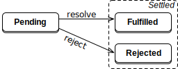
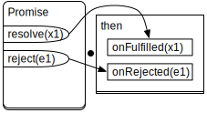
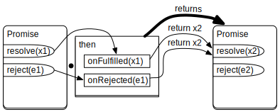

# 【译】通过实现 Promise 来增加对它的理解

> 原文地址：https://exploringjs.com/deep-js/ch_implementing-promises.html

在本章节，我们将从一个不同的角度来探讨 Promise ：通过一个简单的实现，而不是 API 的使用。这个角度曾经对我理解 Promise 帮助很大。  

Promise 的实现是一个类 `ToyPromise`。为了更容易理解，它并没有完全对应 API 。但这已经足够让我们来理解 Promise 是怎样工作的。  

> `ToyPromise` 的 GitHub 仓库[地址](https://github.com/rauschma/toy-promise)

## 复习：Promise的状态



我们先从一个简化版本的 Promise 工作原理开始：  

- 一开始，Promise 状态是 _pending_（待定）。
- 如果 Promise 以一个值 `v` 被 _resolved_ （已决议），那么它的状态会变成 _fulfilled_ （已兑现）（later, we’ll see that resolving can also reject）。 `v` 现在是 Promise 的 _fulfillment value_ （已兑现的值）。
- 如果 Promise 以一个错误 `e` 被 _rejected_ （已拒绝），那么它的状态会变成 _rejected_ （已拒绝）。 `e`现在是 Promise 的 _rejection value_ （已拒绝的值）。

## 版本1：独立的 Promise

我们的第一个实现是一个拥有最小功能的独立运行的Promise：

- 我们可以创建一个 Promise。
- 我们可以 resolve 或者 reject 一个 Promise，并且只能做一次。
- 我们可以通过 `.then()` 注册 `reactions` （callback，回调）。注册能够正常进行，且独立于 Promise 是否已敲定（settled）。
- `.then()` 现在还不支持链式操作 —— 他不会返回任何值。

`ToyPromise` 是一个拥有三个原型方法的类：

- `ToyPromise1.prototype.resolve(value)`
- `ToyPromise1.prototype.reject(reason)`
- `ToyPromise1.prototype.then(onFulfilled, onRejected)`

也就是说， `resolve` 和 `reject` 都是方法（而不是传给构造函数回调参数的函数）。

下面是第一版实现的使用：

```javascript
// .resolve() 在 .then() 之前
const tp1 = new ToyPromise1();
tp1.resolve('abc');
tp1.then((value) => {
    assert.equal(value, 'abc');
});
// .then() 在 .resolve() 之前
const tp2 = new ToyPromise1();
tp2.then((value) => {
    assert.equal(value, 'def');
});
tp2.resolve('def');
```

下图表示了第一版实现的原理。

  

`ToyPromise1`：如果一个 Promise 已决议，那么提供的值会被传递给 _fulfillment reactions_ （ `.then` 的第一个参数）。如果是已拒绝，那么会传给 _rejection reactions_ （ `.then` 的第二个参数）。

### `.then()` 方法

我们首先来查看 `.then()`。它要处理两种情况：

- 如果 Promise 仍在 _pending_ 状态，将调用的 _onFulfilled_ 和 _onRejected_ 入队。当 Promise 状态已敲定后，他们会在稍后被调用。
- 如果 Promise 已经 _fulfilled_ 或 _rejected_，_onFulfilled_ 或 _onRejected_ 会被立即调用。

```javascript
then(onFulfilled, onRejected) {
    const fulfillmentTask = () => {
        if (typeof onFulfilled === 'function') {
            onFulfilled(this._promiseResult)
        }
    }
    const rejectionTask = () => {
        if (typeof onRejected === 'function') {
            onRejected(this._promiseResult)
        }
    }
    switch (this._promiseState) {
        case 'pending':
            this._fulfillmentTasks.push(fulfillmentTask)
            this._rejectionTasks.push(rejectionTask)
            break
        case 'fulfilled':
            addToTaskQueue(fulfillmentTask)
            break
        case 'rejected':
            addToTaskQueue(rejectionTask)
            break
        default:
            throw new Error()
    }
}
```

上面的代码使用了辅助函数：

```javascript
function addToTaskQueue(task) {
    setTimeout(task, 0)
}
```

Promise 必须总是异步地完成。这就是为什么我们不直接执行这些任务，而是把他们添加到事件循环（浏览器， Node.js 等）的任务队列中。请注意，真正的 Promise API 不使用普通任务（如 `setTimeout()`），而是使用 [微任务](https://jakearchibald.com/2015/tasks-microtasks-queues-and-schedules/) ，它与当前的普通任务紧密耦合，并且总是在其后立即执行。

### `.resolve()` 方法

`.resolve()` 的原理如下：如果 Promise 已经完成，它什么都不会做（确保这个 Promise 只能被完成一次）。否则， Promise 的状态变成 "fulfilled" ，并且将结果缓存在 `this.promiseResult`。接着，调用到目前为止所有已入队的已兑现的回调（fulfillment reactions）。

```javascript
resolve(value) {
    if (this._promiseState !== 'pending') return this
    this._promiseState = 'fulfilled'
    this._promiseResult = value
    this._clearAndEnqueueTasks(this._fulfillmentTasks)
    return this // enable chaining
}
_clearAndEnqueueTasks(tasks) {
    this._fulfillmentTasks = undefined
    this._rejectionTasks = undefined
    tasks.map(addToTaskQueue)
}
```

`reject()` 与 `resolve()` 类似。

## 版本2： `.then()` 链式调用



接下来我们来实现的功能是链接（如上图所示）：一个由兑现或者拒绝的回调返回的值可以被下一个 `.then()` 调用中的兑现回调处理。（在下个版本，由于对返回 Promise 的特殊支持，链接会变得非常有用。）

在以下示例中：

- 第一个 `.then()` ：我们在兑现回调中返回了一个值。
- 第二个 `.then()` ：我们通过兑现回调接收了那个值。

```javascript
new ToyPromise2()
    .resolve('result')
    .then(x => {
        assert.equal(x, 'result1')
        return 'result2'
    })
    .then(x => {
        assert.equal(x, 'result2')
    })
```

在以下示例中：

- 第一个 `.then()` ：我们在拒绝回调中返回了一个值。
- 第二个 `.then()` ：我们通过兑现回调接收了那个值。

```javascript
new ToyPromsie2()
    .reject('error1')
    .then(null,
        x => {
            assert.equal(x, 'error1')
            return 'result2'
        })
    .then(x => {
        assert.equal(x, 'result2')
    })
```

## 便捷方法 `.catch()`

新版本引入了一个便捷的方法 `.catch()` ，可以更轻松地仅提供拒绝回调。注意，只提供兑现回调已经十分容易了 —— 我们仅需省略 `.then()` 的第二个参数（如之前的例子所示）。

如果我们使用它来改写前面的例子，看起来会更好（A行）：

```javascript
new ToyPromise2()
    .reject('error1')
    .catch(x => { // (A)
        assert.equal(x, 'error')
        return 'result2'
    })
    .then(x => {
        assert.equal(x, 'result2')
    })
```

下面两个方法的调用是等效的：

```javascript
.catch(rejectionReaction)
.then(null, rejectionReaction)
```

下面是 `.catch()` 的实现：

```javascript
catch(onRejected) { // [new]
    return this.then(null, onRejected)
}
```

## 省略回调

在新版本中，如果我们省略了兑现回调，兑现会被传递，如果省略了拒绝回调，拒绝也会传递。为什么这样做很有用？

下面的例子演示了拒绝的传递：

```javascript
someAsyncFunciton()
    .then(fulfillmentReaction1)
    .then(fulfillmentReaction2)
    .catch(rejectionReaction)
```

`rejectionReaction` 现在可以处理 `someAsyncFunction()`， `fulfillmentReaction1` 和 `fulfillmentReaction2` 的拒绝。

下面的例子演示了兑现的传递：

```javascript
somAsyncFuntion()
    .catch(rejectionReaction)
    .then(fulfillmentReaction)
```

如果 `someAsyncFunction()` 拒绝了它的 Promise，`rejectionReaction` 能修复它的任何错误并且返回一个会被 `fulfillmentReaction` 处理的已兑现的值。

如果 `someAsyncFunction()` 兑现了它的 Promise， `fulfillmentReaction` 也会处理它，因为 `.catch()` 会被跳过。


