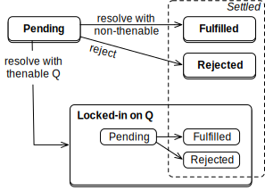
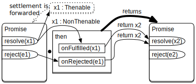
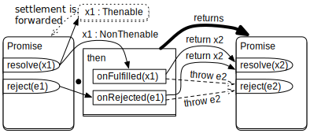

# 【译】通过实现 Promise 来加深理解

> [原文地址](https://exploringjs.com/deep-js/ch_implementing-promises.html)

在本章节，我们将从一个不同的角度来探讨 Promise ：通过一个简单的实现，而不是 API 的使用。这种角度曾经对我理解 Promise 有很大的帮助。  

要实现的 Promise 是一个类 `ToyPromise`。为了更容易理解，它并没有完全对应 API 。但这已经足够让我们来理解 Promise 是怎样工作的。  

> `ToyPromise` 的 GitHub 仓库[地址](https://github.com/rauschma/toy-promise)

## 复习：Promise的状态


我们先从一个简化版本的 Promise 工作原理开始：  

- 一开始，Promise 状态是 _pending_（待定）。
- 如果 Promise 以一个值 `v` 被 _resolved_ （已决议），那么它的状态会变成 _fulfilled_ （已兑现）（稍后，我们将会看到解决中也可以拒绝）。 `v` 现在是 Promise 的 _fulfillment value_ （已兑现的值）。
- 如果 Promise 以一个错误 `e` 被 _rejected_ （已拒绝），那么它的状态会变成 _rejected_ （已拒绝）。 `e`现在是 Promise 的 _rejection value_ （已拒绝的值）。

## 版本1：独立的 Promise

我们的第一个实现是一个拥有最小功能的独立运行的Promise：

- 我们可以创建一个 Promise。
- 我们可以 resolve 或者 reject 一个 Promise，并且只能执行一次。
- 我们可以通过 `.then()` 注册 `reactions` （callback，回调）。注册能够正常进行，且独立于 Promise 是否已敲定（settled）。
- `.then()` 现在还不支持链式操作 —— 他不会返回任何值。

`ToyPromise` 是一个拥有三个原型方法的类：

- `ToyPromise1.prototype.resolve(value)`
- `ToyPromise1.prototype.reject(reason)`
- `ToyPromise1.prototype.then(onFulfilled, onRejected)`

也就是说， `resolve` 和 `reject` 都是方法（而不是传给构造函数回调参数的函数）。

下面是第一版实现的使用：

```javascript
// .resolve() 在 .then() 之前
const tp1 = new ToyPromise1();
tp1.resolve('abc');
tp1.then((value) => {
    assert.equal(value, 'abc');
});
// .then() 在 .resolve() 之前
const tp2 = new ToyPromise1();
tp2.then((value) => {
    assert.equal(value, 'def');
});
tp2.resolve('def');
```

下图表示了第一版实现的原理。

  

`ToyPromise1`：如果一个 Promise 已决议，那么提供的值会被传递给 _fulfillment reactions_ （ `.then` 的第一个参数）。如果是已拒绝，那么会传给 _rejection reactions_ （ `.then` 的第二个参数）。

### `.then()` 方法

我们首先来查看 `.then()`。它要处理两种情况：

- 如果 Promise 仍在 _pending_ 状态，将调用的 _onFulfilled_ 和 _onRejected_ 入队。当 Promise 状态已敲定后，他们会在稍后被调用。
- 如果 Promise 已经 _fulfilled_ 或 _rejected_，_onFulfilled_ 或 _onRejected_ 会被立即调用。

```javascript
then(onFulfilled, onRejected) {
    const fulfillmentTask = () => {
        if (typeof onFulfilled === 'function') {
            onFulfilled(this._promiseResult)
        }
    }
    const rejectionTask = () => {
        if (typeof onRejected === 'function') {
            onRejected(this._promiseResult)
        }
    }
    switch (this._promiseState) {
        case 'pending':
            this._fulfillmentTasks.push(fulfillmentTask)
            this._rejectionTasks.push(rejectionTask)
            break
        case 'fulfilled':
            addToTaskQueue(fulfillmentTask)
            break
        case 'rejected':
            addToTaskQueue(rejectionTask)
            break
        default:
            throw new Error()
    }
}
```

上面的代码使用了辅助函数：

```javascript
function addToTaskQueue(task) {
    setTimeout(task, 0)
}
```

Promise 必须总是异步地完成。这就是为什么我们不直接执行这些任务，而是把他们添加到事件循环（浏览器， Node.js 等）的任务队列中。请注意，真正的 Promise API 不使用普通任务（如 `setTimeout()`），而是使用 [微任务](https://jakearchibald.com/2015/tasks-microtasks-queues-and-schedules/) ，它与当前的普通任务紧密耦合，并且总是在其后立即执行。

### `.resolve()` 方法

`.resolve()` 的原理如下：如果 Promise 已经完成，它什么都不会做（确保这个 Promise 只能被完成一次）。否则， Promise 的状态变成 "fulfilled" ，并且将结果缓存在 `this.promiseResult`。接着，调用到目前为止所有已入队的已兑现的回调（fulfillment reactions）。

```javascript
resolve(value) {
    if (this._promiseState !== 'pending') return this
    this._promiseState = 'fulfilled'
    this._promiseResult = value
    this._clearAndEnqueueTasks(this._fulfillmentTasks)
    return this // enable chaining
}
_clearAndEnqueueTasks(tasks) {
    this._fulfillmentTasks = undefined
    this._rejectionTasks = undefined
    tasks.map(addToTaskQueue)
}
```

`reject()` 与 `resolve()` 类似。

## 版本2： `.then()` 链式调用


接下来我们来实现的功能是链接（如上图所示）：一个由兑现或者拒绝的回调返回的值可以被下一个 `.then()` 调用中的兑现回调处理。（在下个版本，由于对返回 Promise 的特殊支持，链接会变得非常有用。）

在以下示例中：

- 第一个 `.then()` ：我们在兑现回调中返回了一个值。
- 第二个 `.then()` ：我们通过兑现回调接收了那个值。

```javascript
new ToyPromise2()
    .resolve('result')
    .then(x => {
        assert.equal(x, 'result1')
        return 'result2'
    })
    .then(x => {
        assert.equal(x, 'result2')
    })
```

在以下示例中：

- 第一个 `.then()` ：我们在拒绝回调中返回了一个值。
- 第二个 `.then()` ：我们通过兑现回调接收了那个值。

```javascript
new ToyPromsie2()
    .reject('error1')
    .then(null,
        x => {
            assert.equal(x, 'error1')
            return 'result2'
        })
    .then(x => {
        assert.equal(x, 'result2')
    })
```

## 便捷方法 `.catch()`

新版本引入了一个便捷的方法 `.catch()` ，可以更轻松地仅提供拒绝回调。注意，只提供兑现回调已经十分容易了 —— 我们仅需省略 `.then()` 的第二个参数（如之前的例子所示）。

如果我们使用它来改写前面的例子，看起来会更好（A行）：

```javascript
new ToyPromise2()
    .reject('error1')
    .catch(x => { // (A)
        assert.equal(x, 'error')
        return 'result2'
    })
    .then(x => {
        assert.equal(x, 'result2')
    })
```

下面两个方法的调用是等效的：

```javascript
.catch(rejectionReaction)
.then(null, rejectionReaction)
```

下面是 `.catch()` 的实现：

```javascript
catch(onRejected) { // [new]
    return this.then(null, onRejected)
}
```

## 省略回调

在新版本中，如果我们省略了兑现回调，兑现会被传递，如果省略了拒绝回调，拒绝也会传递。为什么这样做很有用？

下面的例子演示了拒绝的传递：

```javascript
someAsyncFunciton()
    .then(fulfillmentReaction1)
    .then(fulfillmentReaction2)
    .catch(rejectionReaction)
```

`rejectionReaction` 现在可以处理 `someAsyncFunction()`， `fulfillmentReaction1` 和 `fulfillmentReaction2` 的拒绝。

下面的例子演示了兑现的传递：

```javascript
somAsyncFuntion()
    .catch(rejectionReaction)
    .then(fulfillmentReaction)
```

如果 `someAsyncFunction()` 拒绝了它的 Promise，`rejectionReaction` 能修复它的任何错误并且返回一个会被 `fulfillmentReaction` 处理的已兑现的值。

如果 `someAsyncFunction()` 兑现了它的 Promise， `fulfillmentReaction` 也会处理它，因为 `.catch()` 会被跳过。

## 实现

这些在底层是如何处理的？

- `.then()` 返回一个从 `onFulfilled` 或 `onRejected` 返回的一个已解决的 Promise 。
- 如果 `onFulfilled` 或 `onRejected` 被省略，无论它们收到的什么都会被传递给 `.then()` 返回的 Promise 。

只改变 `.then()` ：

```javascript
then(onFulfilled, onRejected) {
    const resultPromise = new ToyPromise2() // [new]

    const fulfillmentTask = () => {
        if (typeof onFulfilled === 'function') {
            const returned = onFulfilled(this._promiseResult);
            resultPromise.resolve(returned) // [new]
        } else { // [new]
            // `onFulfilled` 缺失
            // => 我们要传递已兑现的值
            resultPromise.resolve(this._promiseResult)
        }
    };
    const rejectionTask = () => {
        if (typeof onRejected === 'function') {
            const returned = onRejected(this._promiseResult);
            resultPromise.resolve(returned) // [new]
        } else {
            // `onRejected` 缺失
            // => 我们要传递已拒绝的值
            resultPromise.reject(this._promiseResult)
        }
    };
    
    ···
    
    return resultPromise
}
```

`.then()` 创建并返回了一个新的 Promise （方法的第一行和最后一行）。  

此外：  

- `fulfillmentTask` 的工作方式有所改变。下面是兑现后发生的情况：  
    - 如果提供了 `onFullfilled` 。它会被调用然后用其返回的结果去解决 `resultPromise` 。
    - 如果省略了 `onFullfilled` 。我们使用当前 Promise 已兑现的值去解决 `resultPromise` 。
- `rejectionTask ` 的工作方式有所改变。下面是拒绝后发生的情况：  
    - 如果提供了 `onRejected` 。它会被调用然后用其返回的结果去 _解决（resolve）_ `resultPromise` 。注意， `resultPromise` 没有被拒绝：我们假设在 `onRejected()` 中解决了任何问题。
    - 如果省略了 `onRejected` 。我们使用当前 Promise 已拒绝的值去拒绝（reject） `resultPromise` 。

## 版本3：扁平化从 `.then()` 的回调返回的 Promise

### 从 `.then()` 的回调函数返回 Promise

Promise 扁平化主要是让链接更方便：如果我们想将一个 `.then()` 回调函数的值传递给下一个回调函数，我们在前一个回调函数中返回它。然后， `.then()` 将它放入已经返回的 Promise 中。  

如果要从 `.then()` 回调中返回一个 Promise ，这种方法就会变得不方便。例如，基于 Promise 的函数的结果（A行）：  

```javascript
asyncFunc1()
.then((result1) => {
  assert.equal(result1, 'Result of asyncFunc1()');
  return asyncFunc2(); // (A)
})
.then((result2Promise) => {
  result2Promise
  .then((result2) => { // (B)
    assert.equal(
      result2, 'Result of asyncFunc2()');
  });
});
```

此时，将A行返回的值放入 `.then()` 返回的 Promise 中，需要我们将B行的 Promise 打开（unwrap）。如果A行返回的 Promise 能替换掉 `.then()` 返回的 Promise ，那就会方便很多。具体如何做到这一点现在还不清楚，但如果可以的话，我们的代码就可以这样编写：

```javascript
asyncFunc1()
.then((result1) => {
  assert.equal(result1, 'Result of asyncFunc1()');
  return asyncFunc2(); // (A)
})
.then((result2) => {
  // result2 is the fulfillment value, not the Promise
  assert.equal(
    result2, 'Result of asyncFunc2()');
});
```

在A行，我们返回了一个 Promise 。通过 Promise 扁平化， `result2` 现在是这个 Promise 已兑现的值而不是 Promise 本身。

### 扁平化使 Promise 的状态变得更加复杂

> ECMAScript 规范中的 Promise 扁平化  
> 详见 ["Promise Objects"](https://tc39.es/ecma262/#sec-promise-objects) 部分。

Promise 的 API 是如何处理扁平化的？

如果 Promise P 用 Promise Q 来解决，那么 P 不会包裹 Q ， 而是“成为” Q ： P 的状态和已敲定的值现在总是和 Q 的相同。这会有助于我们处理 `.then()` ，因为 `.then()` 解析它某个回调所返回的 Promise 。

P 是如何成为 Q 的？通过 _锁定（locking in）_ Q： P 在外部变得不可被解决，并且 Q 的敲定会触发 P 的敲定。锁定（Lock-in）是一个附加的不可见的 Promise 状态，这会使得状态更加复杂。  

Promise API 有一个附加的特性： Q 不一定是 Promise ， 也可以是一个 _thenable_ 。 thenable 是一个拥有 `.then()` 方法的对象。之所以增加这种灵活性是为了支持不同的 Promise 实现可以协同工作（当 Promise 第一次被添加到语言中来时这是很重要的事情）。  



注意，现在 _解决（resolving）_ 的概念也变得更加复杂。现在，解决一个 Promise 意味着它不会再立刻被敲定：  

- 解决可能会拒绝一个 Promise ：我们可以用一个被拒绝的 Promise 来解决一个 Promise。
- 解决甚至不能敲定一个 Promise ：我们可以用一个一直在待定状态的 Promise 来解决一个 Promise。

ECMAScript 规范是这样表述的：”一个未被解决的 Promise 总是在待定（pending）状态。一个已解决的 Promise 的状态可能是待定（pending），兑现（fulfilled），或者拒绝（rejected）。“

### 实现 Promise 扁平化

下图展示了 `ToyPromise3` 如何处理扁平化：  



我们用下面的函数来检测 thenable ：  

```javascript
function isThenable(value) { // [new]
    return typeof value === 'object' && value !== null
        && typeof value.then === 'function'
}
```

为了实现锁定，我们引入一个布尔标识 `._alreadyResolved`。将它设置成 `true` 会使得 `.resolve()` 和 `.reject()` 无效 —— 例如：  

```javascript
resolve(value) { // [new]
  if (this._alreadyResolved) return this;
  this._alreadyResolved = true;

  if (isThenable(value)) {
    // 将兑现和拒绝从 `value` 传递给 `this`
    // 回调总是异步地执行
    value.then(
      (result) => this._doFulfill(result),
      (error) => this._doReject(error));
  } else {
    this._doFulfill(value);
  }

  return this; // 启用链接
}
```

如果 `value` 是一个 thenable ，那么将当前的 Promise 和它锁定：

- 如果 `value` 被一个值兑现，那么当前的 Promise 也会被这个值兑现。
- 如果 `value` 被一个错误拒绝，那么当前的 Promise 也会被这个错误拒绝。

通过执行私有方法 `._doFulfill()` 和 `._doReject()` 来敲定状态，可以绕过 `._alreadyResolved` 的保护。

`._doFulfill()` 相对简单：

```javascript
_doFulfill(value) { // [new]
    assert.ok(!isThenable(value));
    this._promiseState = 'fulfilled';
    this._promiseResult = value;
    this._clearAndEnqueueTasks(this._fulfillmentTasks);
}
```

`reject()`没有在这展现。他唯一的新功能是现在也需要判断 `._alreadyResolved` 。

## 版本4：在回调中抛出异常



最后一个功能，我们想要我们的 Promise 将用户代码中的异常处理为拒绝（如图）。在本章中，"用户代码"就是 `.then()` 的两个回调参数。

```javascript
new ToyPromise4()
    .resolve('a')
    .then((value) => {
        assert.equal(value, 'a')
        throw 'b' // 触发拒绝
    })
    .catch((error) => {
        assert.equal(error, 'b')
    })
```

`.then()` 现在通过辅助函数 `._runReactionSafely()` 安全的运行 Promise 回调 `onFulfilled` 和 `onRejected` —— 如下所示：

```javascript
const fulfillmentTask = () => {
    if (typeof onFulfilled === 'function') {
        this._runReactionSafely(resultPromise, onFulfilled) // [new]
    } else {
        // `onFulfilled` 被省略
        // => 我们需要传递兑现的值
        resultPromise.resolve(this._promiseResult)
    }
}
```

`.PrunReactionSafely()` 的实现如下：  

```javascript
_runReactionSafely(resultPromise, reaction) { // [new]
    try {
        const returned = reaction(this._promiseResult)
        resultPromise.resolve(returned)
    } catch (e) {
        resultPromise.reject(e)
    }
}
```

## 版本5：暴露构造器模式

我们正在跳过最后一步：如果我们想把 `ToyPromise` 变成一个实际的 Promise 实现，我们还需要实现[暴露构造器模式（ the revealing constructor pattern ）](https://blog.domenic.me/the-revealing-constructor-pattern/)：JavaScript Promise 不是通过方法来解决和拒绝，而是通过传递给执行者（executor）的函数，即构造器的回调参数。  

```javascript
const promise = new Promise(
  (resolve, reject) => { // executor
    // ···
  });
```

如果 executor 抛出一个异常，则 Promise 会被拒绝。
